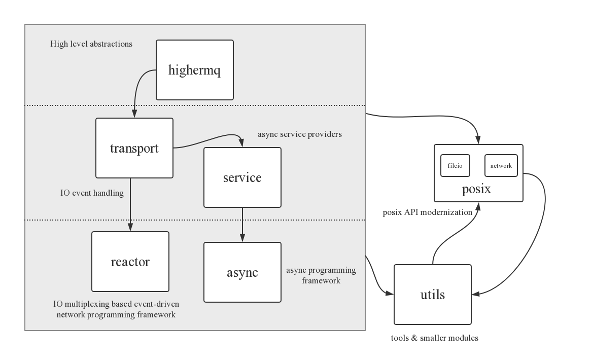

# 架构视角

qaio项目自上而下分为highermq、transport、service、reactor/async四层，posix和utils属于独立模块，可被身处任意位置的代码调用。

posix模块：分为fileio和network两个子模块，分布封装了文件IO和网络相关的posix API，使其接口更加现代化，且遵从qaio项目范式。

utils模块：存放项目中所用到的各种工具或小模块，比如四级缓冲日志、跳表、无锁链表等，往往一个编译单元就足以自给自足地实现一个独立功能。

reactor/async层：

 - reactor模块提供了基于IO多路复用的事件驱动的服务器编程框架（本身除了高性能低成本计时器之外几乎不提供任何解决方案，仅仅是一个编程框架）。Linux的IO多路复用是reactor模式，这种模式本身是同步的，配合reactor模块提供的工作线程池则可保证所有事件有界地执行(boundedly中文似乎找不到太好的词）。

- async模块额外提供了异步任务执行框架，额外提供了专用线程池，供reactor工作线程使用。例如，reactor工作线程在进行域名解析时就可以先让专用的name resolver线程池去处理这个耗时操作，自己先处理其他工作，做完了再wait这个name resolving task。

service层：service层构筑在async层之上，提供某种专用业务的异步服务。

transport层：transport层构筑在service层与reactor层之上，实现了对某种传输层协议（qaio目前只做了tcp）的IO事件进行处理的callback。这个callback中允许使用service层。

highermq层: 在transport层之上再提供高层抽象。比如通信pattern、智能socket，智能connection，投递确认、死信队列。

